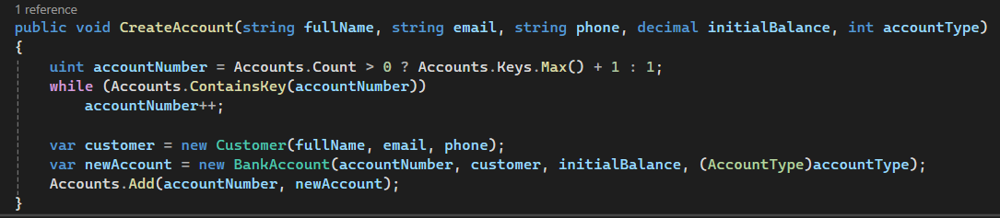
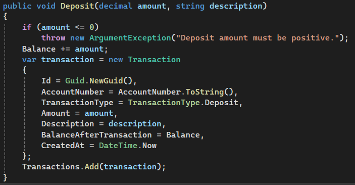
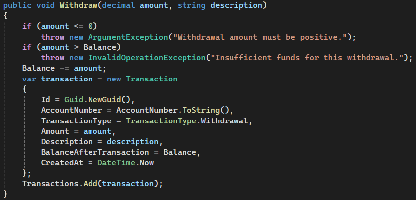
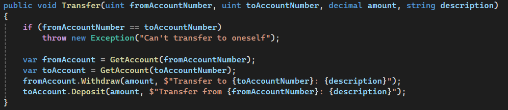
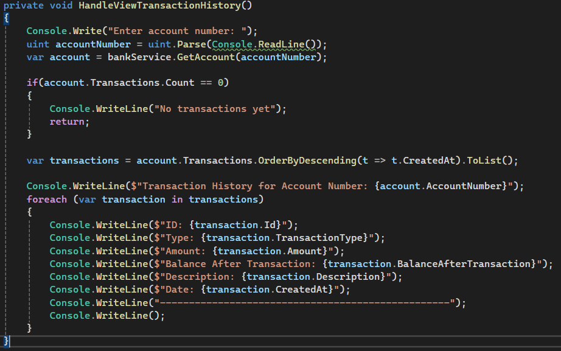

# Task 02 - OOP Bank Account System

A console-based banking system built as part of the TechMaster ASP.NET Backend Career Training - Phase 01.

The purpose of this task is to apply OOP principles to a small business-style system, with a focus on encapsulation, controlled state changes, business rules, validation, and separation of concerns.

## Business Scenario

A small bank needs an internal console system for employees.

The system allows employees to:

- Create customer accounts
- Deposit money
- Withdraw money
- Transfer money between accounts
- View account details
- View transaction history
- View all accounts

Every financial operation is validated, and every successful deposit, withdrawal, or transfer creates a transaction record.

## Project Structure

```text
task-02-bank-account-system/
│
├── README.md
│
└── BankAccountSystem/
    ├── Models/
    │   ├── Customer.cs
    │   ├── BankAccount.cs
    │   ├── Transaction.cs
    │   ├── AccountType.cs
    │   └── TransactionType.cs
    │
    ├── Services/
    │   └── BankService.cs
    │
    ├── UI/
    │   └── ConsoleMenu.cs
    │
    └── Program.cs
```

## Domain Models

### Customer

Represents a bank customer.

**Properties:**
- `Id`
- `FullName`
- `Email`
- `PhoneNumber`
- `CreatedAt`

Customer names, email addresses, and phone numbers are required, and each customer must have a unique ID.

### BankAccount

Represents a customer's bank account.

**Properties:**
- `AccountNumber`
- `Customer`
- `Balance`
- `AccountType`
- `IsActive`
- `Transactions`

The account balance is protected from direct external modification. Balance changes are performed through controlled methods such as `Deposit()` and `Withdraw()`.

### Transaction

Represents a successful financial operation.

**Properties:**
- `TransactionId`
- `AccountNumber`
- `TransactionType`
- `Amount`
- `Description`
- `BalanceAfterTransaction`
- `CreatedAt`

Every successful deposit, withdrawal, or transfer creates a transaction record.

## Encapsulation

The account balance cannot be modified directly from outside the `BankAccount` class.

Instead of directly changing the balance:

```csharp
account.Balance = 5000;
```

the account exposes controlled behavior:

```csharp
account.Deposit(500);
account.Withdraw(200);
```

This keeps the balance protected and ensures that business rules are enforced when the state changes.

## Features

### 1. Create Customer Account

The system asks for:

- Full name
- Email
- Phone number
- Initial balance
- Account type

**Validation includes:**

- Required customer information
- No negative initial balance
- Valid Email
- Valid Phone Number

The account is then added to the in-memory collection.

### 2. Deposit Money

The user provides:

- Account number
- Deposit amount

The system:

1. Validates that the account exists.
2. Validates that the amount is positive.
3. Deposits the money through the account's controlled method.
4. Creates a `Deposit` transaction.

Invalid cases include a missing account, zero amount, and negative amount.

### 3. Withdraw Money

The user provides:

- Account number
- Withdrawal amount

The system:

1. Validates that the account exists.
2. Validates that the amount is positive.
3. Ensures the amount does not exceed the account balance.
4. Withdraws the money through the account's controlled method.
5. Creates a `Withdraw` transaction.

### 4. Transfer Money

The user provides:

- Source account
- Destination account
- Transfer amount

The system validates that:

- Both accounts exist.
- Source and destination accounts are different.
- The source account has sufficient balance.

### 5. View Account Details

Accounts can be searched by account number.

The system displays:

- Account number
- Customer name
- Email
- Phone
- Account type
- Balance
- Created date
- Status

A missing account is handled as an invalid case.

### 6. View Transaction History

Transaction history can be retrieved using an account number.

Transactions are:

- Sorted by date descending.
- Displayed with type, amount, date, description, and balance after transaction.

The system also handles accounts with no transactions.

### 7. View All Accounts

The system displays all accounts with:

- Account number
- Customer name
- Account type
- Balance
- Status

The output is formatted into readable rows.

## Console Menu

```text
====== TechMaster Bank System ======
1. Create Customer Account
2. Deposit Money
3. Withdraw Money
4. Transfer Money
5. View Account Details
6. View Transaction History
7. View All Accounts
8. Exit
Choose an option:
```

## Separation of Responsibilities

The application separates responsibilities into three main areas.

### Models

Contain the domain objects and their behavior.

**Examples:**
- `Customer`
- `BankAccount`
- `Transaction`

### Services

`BankService` handles application-level business operations such as:

- Account creation
- Finding accounts
- Deposits
- Withdrawals
- Transfers
- Transaction history

### UI

`ConsoleMenu` handles:

- Displaying the menu
- Reading user input
- Displaying results
- Calling the appropriate service methods

Business logic is kept out of the console menu so that the core operations remain reusable and easier to test.

## Validation & Edge Cases

The system handles the following invalid scenarios:

- Empty customer name
- Invalid customer information
- Negative initial balance
- Duplicate account number
- Missing account
- Zero deposit
- Negative deposit
- Negative withdrawal
- Withdrawal greater than balance
- Missing source account
- Missing destination account
- Transfer to the same account
- Insufficient transfer balance
- Account with no transactions
- No accounts available

## Running the Application

1. Clone the repository.
2. Open the Task 02 project in Visual Studio or your preferred .NET IDE.
3. Build the project.
4. Run the application.

```bash
dotnet run
```

The application starts with the bank console menu.


### Screenshots

#### Create Account



#### Deposit



#### Withdraw



#### Transfer



#### Transaction History


