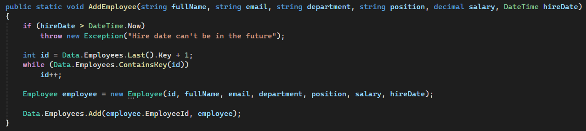
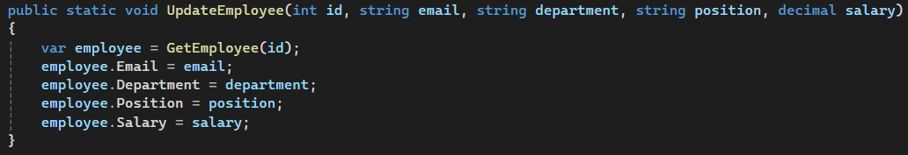
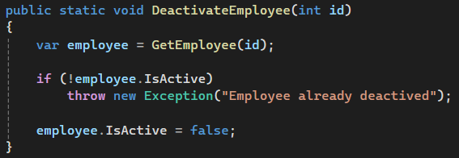
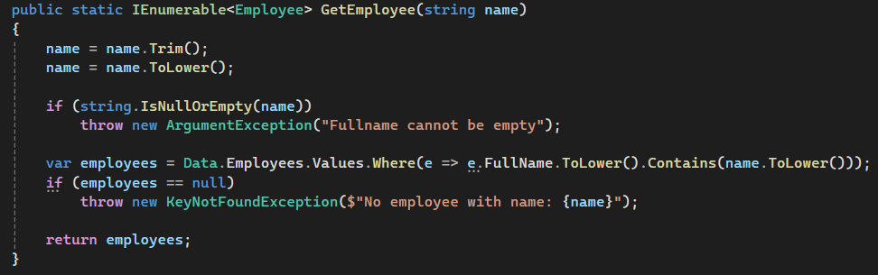
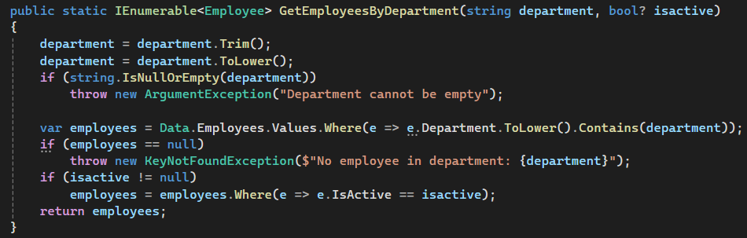
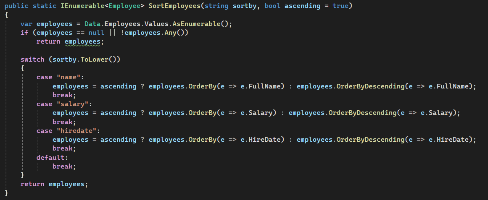
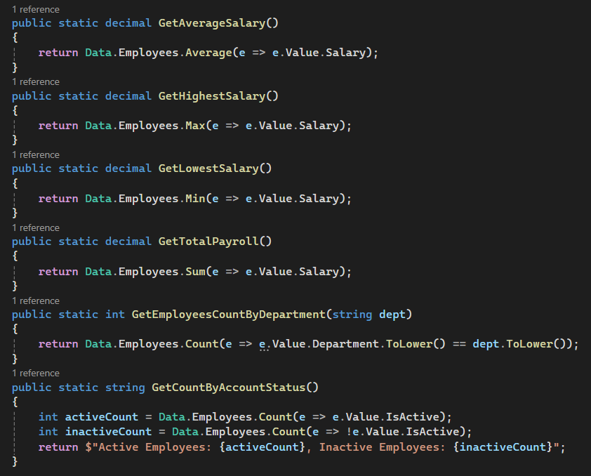
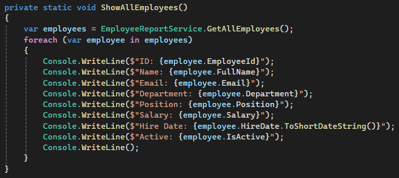

# Task 03 - Employee Management Console App

A console-based employee management system built as part of the TechMaster ASP.NET Backend Career Training - Phase 01.

The task focuses on working with collections, search, filtering, sorting, simple reports, validation, and separation of responsibilities between models, services, data access, and the console UI.

## Business Scenario

A company needs a simple internal console application to manage employees.

The system allows HR to:

- Add employees
- Update employee information
- Deactivate employees
- Search employees
- Filter employees by department
- Sort employees
- View salary and workforce reports
- View all employees

The application keeps employee data in memory and starts with seed data so that the search, filtering, sorting, and reporting features can be demonstrated with meaningful data.

## Project Structure

```text
task-03-employee-management/
│
├── README.md
│
└── EmployeeManagement/
    ├── Models/
    │   └── Employee.cs
    │
    ├── DataAccess/
    │   ├── employees_seed_data.csv
    │   └── Data.cs
    │
    ├── Services/
    │   ├── EmployeeService.cs
    │   └── EmployeeReportService.cs
    │
    ├── UI/
    │   └── ConsoleMenu.cs
    │
    └── Program.cs
```

## Data Access

The `DataAccess` folder contains the seed dataset and the in-memory employee store.

The application uses a global dictionary to hold the employees:

```text
Dictionary<int, Employee>
```

The employee data is loaded from the seed dataset when the application starts. This gives the application an initial set of employees while keeping the data in memory during execution.

The dictionary uses `EmployeeId` as its key, making employee lookup by ID efficient and ensuring that employee IDs remain unique.

## Employee Model

The `Employee` model represents an employee in the system.

**Required fields:**

- `EmployeeId`
- `FullName`
- `Email`
- `Department`
- `Position`
- `Salary`
- `HireDate`
- `IsActive`

## Seed Data

The application starts with at least 12 employees so that the different search, filter, sorting, and reporting operations have meaningful results.

The seed data includes employees from departments such as:

- IT
- HR
- Sales
- Finance
- Marketing
- Support

It also includes both active and inactive employees.

## Features

### 1. Add Employee

The system asks for all required employee information.

Validation includes:

- Required fields must be provided.
- `EmployeeId` must be unique.
- Salary must be positive.
- Hire date cannot be in the future.
- New employees are added as active.

The feature is implemented through the service layer rather than directly inside the console menu.

### 2. Update Employee

The user provides an `EmployeeId` and can update:

- Email
- Department
- Position
- Salary

The `EmployeeId` remains unchanged.

Validation prevents:

- Empty values
- Negative salary values
- Updating an employee that does not exist

### 3. Deactivate Employee

Employees are not removed from the dictionary when deactivated.

Instead:

```text
IsActive = false
```

This preserves the employee record while preventing the employee from being treated as active.

### 4. Search Employees

Employees can be searched by:

- Employee ID
- Full name
- Partial name

Name searches are case-insensitive.

For example, searching for:

```text
ahmed
```

can find:

```text
Ahmed Tarek
```

### 5. Filter by Department

The user provides a department name.

The filter:

- Matches the department case-insensitively.
- Shows active employees by default.
- Handles inactive employees according to the selected filtering behavior.

### 6. Sort Employees

Employees can be sorted by:

- Salary ascending
- Salary descending
- Hire date ascending
- Hire date descending
- Name

### 7. Salary Reports

The reporting service provides:

- Average salary
- Highest salary employee
- Lowest salary employee
- Total payroll
- Employee count by department
- Active employee count
- Inactive employee count

These reports are calculated from the in-memory employee collection.

### 8. View All Employees

The system displays the employees currently stored in memory, including their relevant employee information and active/inactive status.

## Console Menu

```text
====== Employee Management System ======
1. Add Employee
2. Update Employee
3. Deactivate Employee
4. Search Employee
5. Filter by Department
6. Sort Employees
7. Show Salary Reports
8. View All Employees
9. Exit
```

## Separation of Responsibilities

The application is separated into four main areas.

### Models

Contains the domain model:

- `Employee`

The model represents employee data and its state.

### Data

Responsible for:

- Loading the seed dataset.
- Maintaining the global in-memory employee dictionary.
- Providing the initial employee data when the application starts.

### Services

#### EmployeeService

Handles employee-related operations such as:

- Adding employees
- Updating employees
- Deactivating employees

#### EmployeeReportService

Handles reporting operations such as:

- Searching employees
- Filtering employees
- Sorting employees
- Average salary
- Highest salary
- Lowest salary
- Total payroll
- Employee counts by department
- Active/inactive counts

### UI

`ConsoleMenu` handles:

- Displaying the menu
- Reading user input
- Calling the appropriate service methods
- Displaying results and validation messages

Business logic is kept out of the menu so that the service layer remains reusable and easier to test.

## Validation & Edge Cases

The application handles important invalid cases including:

- Duplicate `EmployeeId`
- Missing employee
- Empty required values
- Negative salary
- Future hire date
- Partial name searches
- Case-insensitive searches
- Deactivating an employee without removing the record
- Filtering with inactive employees
- Empty result sets

## Screenshots Evidence

The Task 03 review requires evidence of the implemented features and their output.

### Add Employee



### Update Employee



### Deactivate Employee



### Search Employee



### Filter by Department



### Sort Employees



### Salary Reports



### View All Employees



## Running the Application

1. Open the `EmployeeManagement` project in Visual Studio or your preferred .NET IDE.
2. Build the project.
3. Run the application.

```bash
dotnet run
```

On startup, the application loads the seed employee data into the in-memory dictionary and displays the employee management menu.