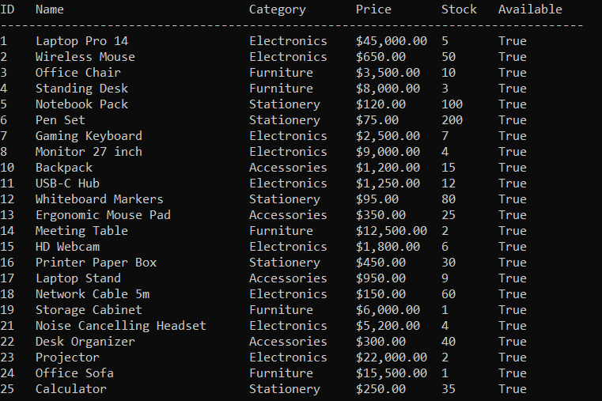
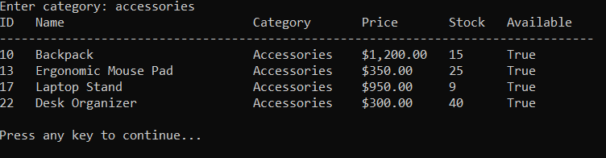
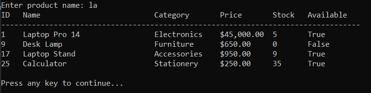
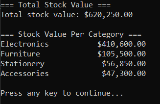
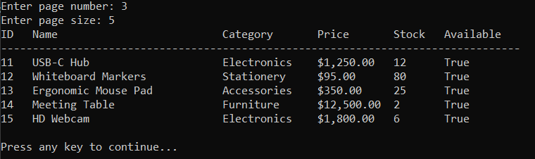

# Task 04 - Product Catalog with LINQ

A console-based product catalog application built as part of the TechMaster ASP.NET Backend Career Training - Phase 01.

The task focuses on using LINQ to solve common backend data-processing problems such as filtering, searching, sorting, grouping, projection, aggregation, reporting, and pagination.

## Business Scenario

A small online store has a product catalog.

The manager needs to search, filter, group, and report products in the catalog. The application implements these business questions using LINQ, providing practice for the query patterns that will later be used with EF Core.

## Project Structure

```text
task-04-product-catalog-linq/
│
├── README.md
│
└── ProductCatalogLinq/
    ├── Models/
    │   ├── Product.cs
    │   └── DTOs/
    │       ├── ProductCountPerCategory.cs
    │       ├── StockValuePerCategory.cs
    │       ├── ProductSummary.cs
    │       ├── SupplierReport.cs
    │       └── CategoryStatistics.cs
    │
    ├── Services/
    │   ├── ProductQueryService.cs
    │   └── products_seed_data.csv
    │
    ├── UI/
    │   └── ConsoleMenu.cs
    │
    └── Program.cs
```

## Product Model

The `Product` model represents an item in the catalog.

**Properties:**

- `Id`
- `Name`
- `Category`
- `Price`
- `Stock`
- `CreatedAt`
- `IsAvailable`
- `Supplier`

The application uses at least 25 products as required by the task.

## Data Loading

The product catalog is initialized from the seed CSV dataset.

`ProductQueryService.LoadCSV()` reads the dataset, skips the header row, creates `Product` objects, and stores them in the in-memory product collection.

The data is loaded when the application starts so that all LINQ queries operate on the same catalog.

## LINQ Queries

The application implements 20 LINQ queries covering filtering, searching, sorting, grouping, projection, aggregation, reporting, and pagination.

### 1. Available Products

Returns products that are both available and currently in stock.

```csharp
_products.Where(p => p.IsAvailable && p.Stock != 0)
```

This applies the business rule that a product must be marked available and have stock greater than zero.

### 2. Products by Category

Returns products belonging to the requested category.

The category comparison is case-insensitive.

### 3. Products by Price Range

Returns products whose prices fall between the supplied minimum and maximum values.

The price range is inclusive.

The application validates that:

- Prices are not negative.
- The maximum price is not lower than the minimum price.

### 4. Search by Product Name

Searches product names using a partial keyword.

The search is case-insensitive.

Empty or whitespace-only search terms are rejected.

### 5. Sort by Price Ascending

Returns products from cheapest to most expensive using `OrderBy`.

### 6. Sort by Price Descending

Returns products from most expensive to cheapest using `OrderByDescending`.

### 7. Group Products by Category

Groups products according to their category using `GroupBy`.

The console output displays each category as a group with its products underneath.

### 8. Product Count per Category

Groups products by category and calculates the number of products in each category using `GroupBy` and `Count`.

The result contains:

- Category
- Product count

### 9. Total Stock Value

Calculates the total value of all inventory.

```text
Total Stock Value = Sum(Price × Stock)
```

The calculation uses `decimal` for monetary values.

### 10. Stock Value per Category

Groups products by category and calculates the total inventory value for each category.

```text
Category Stock Value = Sum(Price × Stock)
```

### 11. Top 5 Most Expensive Products

Sorts products by price descending and returns the first five products using `Take(5)`.

### 12. Low Stock Products

Returns products with stock less than or equal to five.

The output includes the product name and stock quantity.

### 13. Out of Stock Products

Returns products that either:

- Have zero stock, or
- Are marked as unavailable.

This represents the business rule for products that cannot currently be purchased.

### 14. Product Summary DTO Projection

Projects products into a simplified `ProductSummary` object.

The summary contains:

- Product name
- Stock quantity
- Availability status

This simulates the use of response DTOs in backend APIs.

### 15. Supplier Report

Groups products by supplier and produces a report containing:

- Supplier
- Product count
- Total stock value
- Average product price

### 16. Recently Added Products

Returns products created within the last 60 days.

The comparison is based on the product `CreatedAt` value.

### 17. Category Statistics

Groups products by category and calculates:

- Product count
- Average price
- Maximum price
- Minimum price
- Total stock value

The result is projected into a `CategoryStatistics` DTO.

### 18. Products Above Average Price

First calculates the average product price and then returns products whose price is greater than that average.

This demonstrates a two-step LINQ query.

### 19. Search + Filter Combined

Applies multiple optional filters to the product collection:

- Category
- Minimum price
- Maximum price
- Availability

The query is built incrementally using a chain of `Where` operations.

This pattern is similar to filtering functionality commonly used in backend APIs.

### 20. Pagination Simulation

Returns a specific page of products using:

```csharp
Skip((page - 1) * pageSize)
    .Take(pageSize)
```

The page number is validated to ensure it is greater than zero.

## Console Menu

```text
====== Product Catalog LINQ System ======
1. View Available Products
2. Filter by Category
3. Filter by Price Range
4. Search by Name
5. Sort by Price
6. Group by Category
7. Stock Value Reports
8. Low Stock Products
9. Supplier Report
10. Pagination Demo
11. Exit
```

## Separation of Responsibilities

The application separates responsibilities into three main areas.

### Models

Contains the product domain model and DTOs used for query projections and reports.

**Examples:**

- `Product`
- `ProductSummary`
- `ProductCountPerCategory`
- `StockValuePerCategory`
- `SupplierReport`
- `CategoryStatistics`

### Services

`ProductQueryService` contains the LINQ query implementations.

It is responsible for:

- Loading the product dataset
- Filtering
- Searching
- Sorting
- Grouping
- Aggregation
- Projection
- Reporting
- Pagination

Each query is implemented as a clearly named method inside `ProductQueryService`.

### UI

`ConsoleMenu` handles:

- Displaying the menu
- Reading user input
- Calling the appropriate query methods
- Displaying readable results
- Handling user-facing validation messages

The LINQ logic is kept out of the console menu.


## Demo Evidence

The task requires readable console output for the implemented queries and screenshots for five selected queries.

### Available Products



### Filter by Category



### Search by Name



### Stock Value Report



### Pagination



## Running the Application

1. Open the `ProductCatalogLinq` project in Visual Studio or your preferred .NET IDE.
2. Build the project.
3. Run the application.

```bash
dotnet run
```

The application loads the product dataset and displays the Product Catalog LINQ menu.