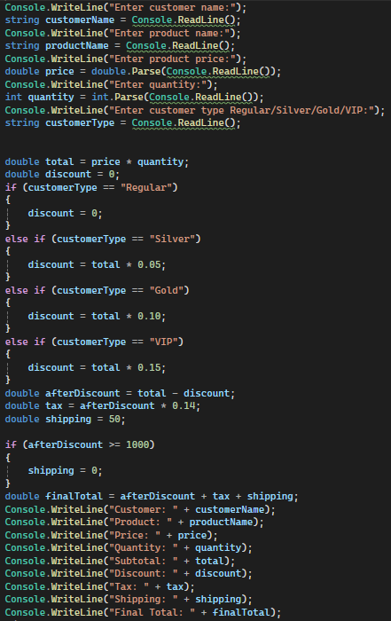
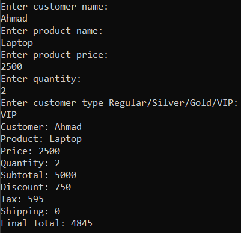
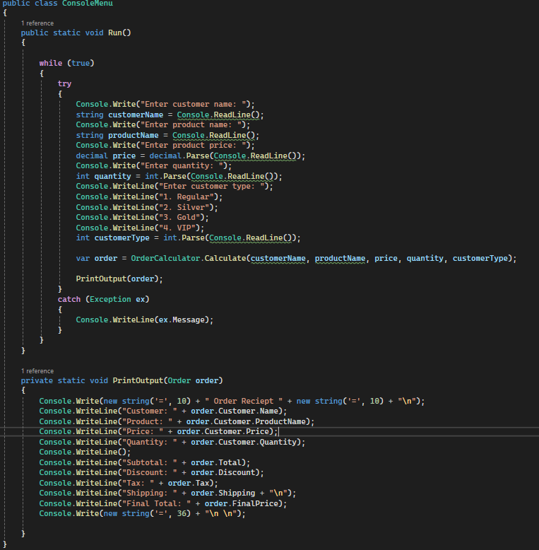
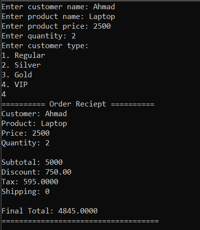

# Task 05 - Debug & Refactor Pack

A refactored console-based order calculator built as part of the TechMaster ASP.NET Backend Career Training - Phase 01.

The purpose of this task is to take an intentionally messy implementation, improve its structure and maintainability, and preserve the original business behavior.

## Business Scenario

The original application calculates an order total based on:

- Customer name
- Product name
- Product price
- Quantity
- Customer type

The calculation applies:

- Customer discounts
- Tax
- Shipping fees

The refactoring keeps the original purpose and functionality while separating responsibilities and making the business rules easier to understand and maintain.

## Original Code

The original implementation was provided as a single `Program.cs` file containing:

- Console input
- Validation assumptions
- Order calculations
- Discount rules
- Tax calculation
- Shipping calculation
- Receipt output

The original file is preserved separately as required:

```text
original-bad-code/
└── Program.cs
```

## Refactored Project Structure

```text
task-05-debug-refactor-pack/
│
├── README.md
├── original-bad-code/
│   └── Program.cs
│
└── refactored/
    ├── Models/
    │   ├── Customer.cs
    │   └── Order.cs
    ├── Services/
    │   └── OrderCalculator.cs
    ├── UI/
    │   └── ConsoleMenu.cs
    └── Program.cs
```

## Models

### Customer

The `Customer` class represents the customer placing the order.

Instead of passing around unclear variables such as `c` and `t`, customer information is represented by a dedicated domain object.

### Order

The `Order` class represents the order being calculated.

It groups the information that was previously held as separate variables:

- Product name
- Product price
- Quantity
- Customer

## OrderCalculator

`OrderCalculator` contains the business rules that were previously mixed directly into the console input flow.

Its responsibilities include:

- Calculating subtotal
- Calculating discount
- Calculating total after discount
- Calculating tax
- Calculating shipping
- Calculating final total

This separates business logic from user interaction.

## Business Rules

The original business rules are preserved.

### Validation

- Quantity must be positive.
- Customer name cannot be empty.
- Product name cannot be empty.
- Price must be positive.

### Customer Discounts

| Customer Type | Discount |
|---|---:|
| Regular | 0% |
| Silver | 5% |
| Gold | 10% |
| VIP | 15% |

### Tax

Tax is calculated at **14%**.

Tax is applied after the discount.

### Shipping

Shipping is **50** when the amount after discount is below `1000`.

Shipping is **0** when the amount after discount is `1000` or more.

### Calculation Order

```text
Subtotal
    ↓
Discount
    ↓
Amount after discount
    ↓
Tax
    ↓
Shipping
    ↓
Final total
```

The required business rules specify that discount is applied before tax, tax is applied after discount, and shipping is added after tax.

## Refactoring Improvements

### 1. Renamed unclear variables

Variables such as `c`, `p`, `pr`, `q`, and `t` were replaced with descriptive names and domain properties.

### 2. Created a Customer class

Customer information was extracted into a dedicated `Customer` model.

### 3. Created an Order class

Order-related information was grouped into an `Order` model.

### 4. Created OrderCalculator

The calculation logic was moved out of `Program.cs` into `OrderCalculator`.

### 5. Added validation

The refactored implementation validates customer name, product name, price, quantity, and other required inputs.

### 6. Replaced magic numbers with constants

Tax rate, shipping fee, free-shipping threshold, and discount rates are represented using named constants.

### 7. Extracted calculation logic

The calculation is broken into logical operations rather than being performed entirely inside `Main()`.

### 8. Separated console input from business logic

The UI handles user interaction while `OrderCalculator` handles the business rules.

### 9. Improved receipt output

The final receipt is presented in a clearer and more structured format.

### 10. Removed duplicate logic

Repeated calculation and decision-making logic was consolidated into the appropriate methods and classes.

### 11. Improved readability

Meaningful class, method, property, and variable names make the code easier to understand.

### 12. Improved maintainability

Business rules are centralized in `OrderCalculator`, making future changes easier to implement.

## Before vs After

### Before

The original implementation placed everything inside `Main()`:

```text
Console Input
     ↓
Parsing
     ↓
Calculation
     ↓
Discount
     ↓
Tax
     ↓
Shipping
     ↓
Receipt Output
```

This made one method responsible for too many concerns.

### After

The refactored implementation separates those responsibilities:

```text
Console UI
    ↓
Customer / Order Models
    ↓
OrderCalculator
    ↓
Calculation Result
    ↓
Receipt Output
```

The application still performs the same business calculation, but the responsibilities are now separated.

## Validation & Edge Cases

The refactored application handles:

- Empty customer name
- Empty product name
- Non-positive price
- Non-positive quantity
- Invalid customer type
- Invalid input values

Invalid input is rejected before the calculation is performed.

## Console Output

The refactored receipt provides a clearer representation of the calculation.

```text
========== Order Receipt ==========

Customer       : Ahmed
Product        : Laptop
Price          : 2500
Quantity       : 2

Subtotal       : 5000
Discount       : 750
After Discount : 4250
Tax            : 595
Shipping       : 0

Final Total    : 4845

===================================
```

The exact output depends on the input values.

## Screenshots

### Before Refactoring



### Before Refactoring - Output



### After Refactoring



### After Refactoring - Output



## Git History

The refactoring should be represented through meaningful commits rather than one final upload.

Example progression:

1. `add original messy order calculator`
2. `extract order model`
3. `add customer model and validation`
4. `move calculations to order calculator`
5. `improve receipt output and readme`

These commits demonstrate the refactoring process and make the changes reviewable.

## Running the Application

1. Open the refactored project in Visual Studio or your preferred .NET IDE.
2. Build the project.
3. Run the application.

```bash
dotnet run
```

The application prompts for the order information and displays the calculated receipt.