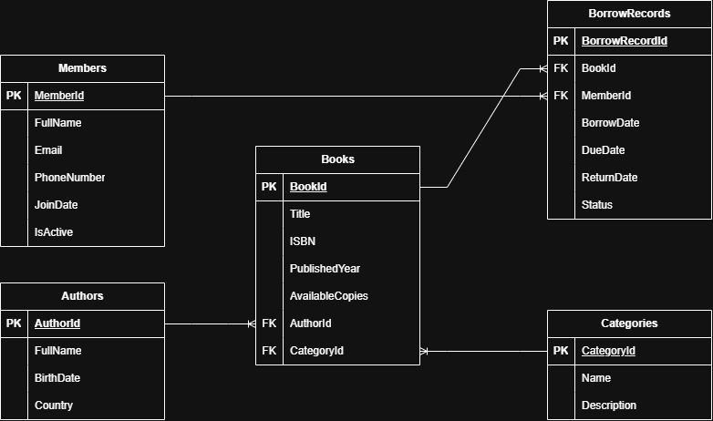

# Task 06 - SQL & ERD Starter

## Selected Scenario

Library Management System

A small library needs to manage books, authors, categories, members, and borrowing operations. Each book belongs to one author and one category. Members can borrow books, and each borrowing operation records the borrow date, due date, return date, and current status.

## ERD

## Main Entities

- Authors
- Categories
- Books
- Members
- BorrowRecords

## Main Fields

### Authors
- AuthorId (PK)
- FullName
- BirthDate
- Country

### Categories
- CategoryId (PK)
- Name
- Description

### Books
- BookId (PK)
- Title
- ISBN
- PublishedYear
- AvailableCopies
- AuthorId (FK)
- CategoryId (FK)

### Members
- MemberId (PK)
- FullName
- Email
- PhoneNumber
- JoinDate
- IsActive

### BorrowRecords
- BorrowRecordId (PK)
- BookId (FK)
- MemberId (FK)
- BorrowDate
- DueDate
- ReturnDate
- Status

## Relationships

- Author has many Books
- Category has many Books
- Member has many BorrowRecords
- Book has many BorrowRecords

## Why I Designed It This Way

The database separates books, authors, categories, members, and borrowing operations into independent entities. A book references its author and category through foreign keys, avoiding duplication of author and category information across book records. BorrowRecords represents the relationship between members and books while also storing information specific to each borrowing operation, such as the borrow date, due date, return date, and status. This allows a member to have multiple borrowing records and a book to appear in multiple borrowing records over time. Primary keys uniquely identify each record, while foreign keys maintain the relationships between related tables. The design also makes it possible to query borrowing history, availability, overdue books, and category or author statistics.

## SQL Queries

The following queries are required for this task:

1. Select all books.
2. Select all active members.
3. Select books by category.
4. Count books per category.
5. Select borrow records with member name and book title using JOIN.
6. Select overdue books.
7. Select borrowing history for one member.
8. Select available books.
9. Count how many books each author has.
10. Select top 5 most borrowed books.

See `library_queries.sql` for the SQL implementations.

## Deliverables

- ERD diagram
- Table and field definitions
- Primary keys and foreign keys
- Relationship explanation
- Required SQL queries