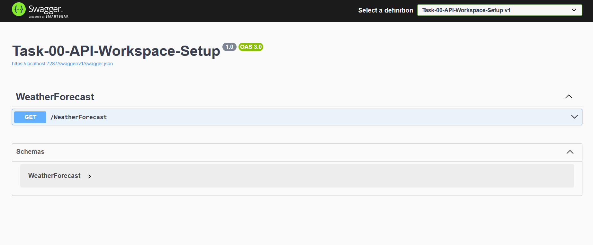

# Task 00 - API Workspace Setup

## Overview

This task sets up the ASP.NET Core Web API workspace for Phase 02.

The project is configured with:

* ASP.NET Core Web API
* Controllers
* Swagger / OpenAPI
* HTTPS redirection

## Prerequisites

* .NET 10 SDK recommended
* .NET 8+ compatible
* Visual Studio 2022/2026 or VS Code

## How to Run

### Using .NET CLI

1. Open a terminal in the API project directory.

2. Restore the project dependencies:

```bash
dotnet restore
```

3. Run the application:

```bash
dotnet run
```

4. The terminal will display the URLs where the application is running.

5. Open the HTTPS URL followed by `/swagger`:

```text
https://localhost:<port>/swagger
```

Swagger should open and display the available API endpoints.

### Using Visual Studio

1. Open the solution in Visual Studio.
2. Set the API project as the startup project if necessary.
3. Run the application using **HTTPS**.
4. Swagger should open automatically in the browser.

If it does not open automatically, navigate to:

```text
https://localhost:<port>/swagger
```

## Swagger

Swagger is used to view and test the API endpoints.

**Swagger URL:**

```text
https://localhost:<port>/swagger
```

> Replace `<port>` with the HTTPS port assigned to the application when it runs.

## Project Configuration

The application is configured to:

* Register controllers.
* Enable API endpoint discovery.
* Generate Swagger/OpenAPI documentation.
* Enable Swagger UI in the Development environment.
* Redirect HTTP requests to HTTPS.
* Map controller routes.

## Evidence

### Swagger Screenshot

