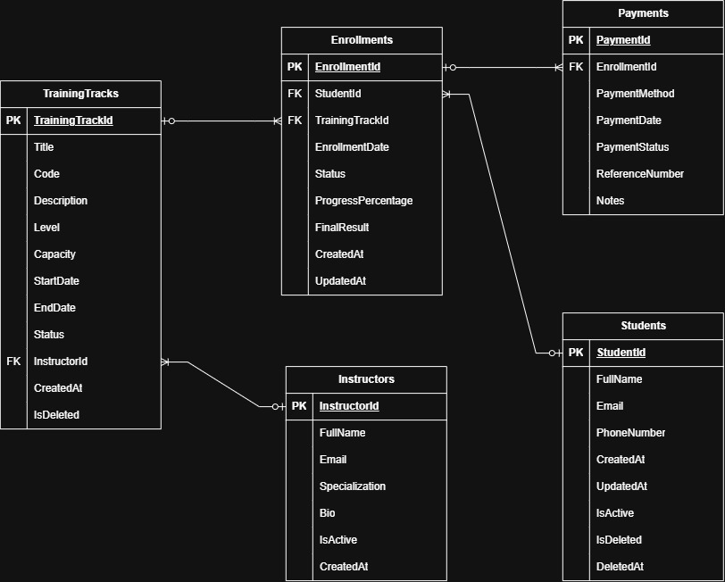

# Task 02 --- Requirements to ERD

## Overview

**Objective:** Translate the training center requirements into a
relational database design and document the design decisions.

-   **Project:** Training Center Management System
-   **Task:** Requirements to ERD

------------------------------------------------------------------------

## 1. ERD

------------------------------------------------------------------------

## 2. Tables List

  | Table | Purpose |
  |---|---|
  |Student | Stores students' info |
  |Instructor | Stores instructors' info |
  |TrainingTrack | Stores the tracks' info and its' instructor |
  |Enrollment | Stores the enrollments of students in specific tracks |
  |Payment | Stores the payment info for enrollments |

------------------------------------------------------------------------

## 3. Fields List

### Student

  | Field | Data Type | Required? | Constraints / Notes |
  |---|---|---|---|
  | StudentId | Guid | Yes | Primary Key |
  | FullName | string | Yes |  |
  | Email | string |  | Unique |
  | PhoneNumber | string |  |  |
  | CreatedAt | DateTime | Yes |  |
  | UpdatedAt | DateTime | No | Nullable |
  | IsActive | bool | Yes |  |
  | IsDeleted | bool | Yes |  |
  | DeletedAt | DateTime | No | Nullable |

### Instructor

  | Field | Data Type | Required? | Constraints / Notes |
  |---|---|---|---|
  | InstructorId | Guid | Yes | Primary Key |
  | FullName | string | Yes |  |
  | Email | string | Yes | Unique |
  | Specialization | string | Yes |  |
  | Bio | string | No | Nullable |
  | IsActive | bool | Yes |  |
  | CreatedAt | DateTime | Yes |  |

### TrainingTrack

  | Field | Data Type | Required? | Constraints / Notes |
  |---|---|---|---|
  | TrainingTrackId | Guid | Yes | Primary Key |
  | Title | string | Yes |  |
  | Code | string | Yes |  |
  | Description | string | No |  |
  | Level | int | Yes |  |
  | Capacity | int | Yes |  |
  | StartDate | DateTime | Yes |  |
  | EndDate | DateTime | Yes |  |
  | Status | int(enum) | Yes | |
  | InstructorId | Guid | Yes | Foreign Key |
  | CreatedAt | DateTime | Yes |  |
  | IsDeleted | bool | Yes |  |

### Enrollment

  | Field | Data Type | Required? | Constraints / Notes |
  |---|---|---|---|
  | EnrollmentId | Guid | Yes | Primary Key |
  | StudentId | Guid | Yes | Foreign Key |
  | TrainingTrackId | Guid | Yes | Foreign Key |
  | EnrollmentDate | DateTime | Yes | |
  | Status | int(enum) | Yes |  |
  | ProgressPercentage | byte/tinyint | Yes | |
  | FinalResult | float | No | Nullable |
  | CreatedAt | DateTime | Yes |  |
  | UpdatedAt | DateTime | No | Nullable |

### Payment

  |Field | Data Type | Required? | Constraints / Notes |
  |---|---|---|---|
  |PaymentId | Guid | Yes | Primary Key |
  |EnrollmentId | Guid | Yes | Foreign Key |
  |Amount | decimal | Yes |  |
  |PaymentMethod | string | Yes |  |
  |PaymentDate | DateTime | Yes |  |
  |PaymentStatus | int(enum) | Yes |  |
  |ReferenceNumber | string | Yes |  |
  |Notes | string | No | Nullable |

------------------------------------------------------------------------

## 4. Primary Keys (PK) and Foreign Keys (FK)

  |Table | Primary Key | Foreign Key(s) |
  |---|---|---|
  |Student | StudentId | None |
  |Instructor | InstructorId | None |
  |TrainingTrack | TrainingTrackId | InstructorId |
  |Enrollment | EnrollmentId | StudentId, TrainingTrackId |
  |Payment | PaymentId | EnrollmentId |

------------------------------------------------------------------------

## 5. Relationships

  |Relationship | Cardinality | Explanation |
  |---|---|---|
  |Instructor --- TrainingTrack | 1 to Many | An Instructor can teach multiple Tracks |
  |Student --- Enrollment | 1 to Many | A Student can enroll in many Tracks |
  |TrainingTrack --- Enrollment | 1 to Many | A Track can be enrolled by many Students |
  |Enrollment --- Payment | 1 to Many | An Enrollment can have many payments |

------------------------------------------------------------------------

## 6. Business Questions

1.  **Which students are enrolled in a specific track?**\
    Enrollments store both TrackId and StudentId, so filter enrollments by the track and get the students.

2.  **Which tracks have available seats?**\
    Get tracks where capacity is not full. (Tracks store Capacity)

3.  **Which enrollments are unpaid?**\
    Get enrollments with payments where Status is pending or unpaid. (Payments store EnrollmentId)

4.  **How much revenue did each track generate?**\
    Get the sum of Payments where Status is Paid of all Enrollments of each Track. (Payments store EnrollmentId, Enrollments store TrackId)

5.  **Which instructor has the highest workload?**\
    Get the instructor with Tracks where the sum of the Track Capacity is the highest. (Tracks store both Capacity and InstructorId)

6.  **Which students have active enrollments?**\
    Get the students where the Enrollments with their Id has Status Active. (Enrollments store both Status and StudentId)

7.  **Which tracks start this month?**\
    Get the Tracks where StartDate is this month. (Tracks store StartDate)

8.  **What is the payment history for an enrollment?**\
    The record of all the payment operations and their Status for a specific enrollment.

9.  **Which tracks are full?**\
    Get tracks where capacity is  full. (Tracks store Capacity)

10. **How many enrollments exist by status?**\
    Get the count of Enrollments filtered by status. (Enrollments store Status)
